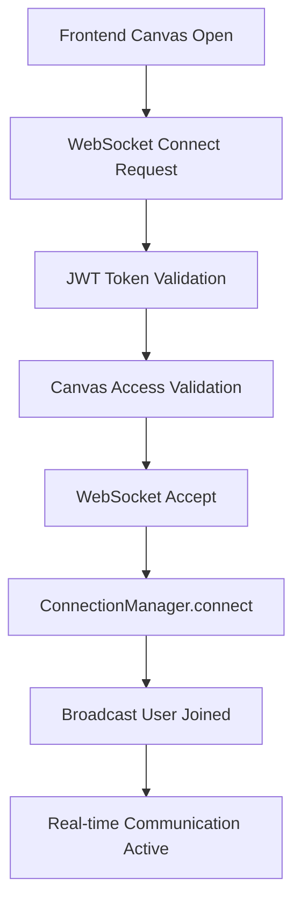

# 🔌 WebSocket Implementation Guide

## 📖 Overview

The StellarCollabApp uses WebSockets for real-time collaboration features including live canvas updates, chat messaging, user presence tracking, and tile editing coordination.

## 🏗️ Architecture

### **Core Components**
- **ConnectionManager**: Central WebSocket connection management (`backend/app/core/websocket.py`)
- **WebSocket Endpoints**: API endpoints for WebSocket connections (`backend/app/api/v1/websockets.py`)
- **Frontend WebSocketManager**: Client-side connection management (`frontend/js/modules/managers/websocket-manager.js`)
- **Event Integration**: WebSocket events integrated with EventManager system

### **Connection Flow**


## 🔗 Backend Implementation

### **ConnectionManager Class**
**File**: `backend/app/core/websocket.py`

#### **Properties**
```python
class ConnectionManager:
    canvas_connections: Dict[int, Dict[int, WebSocket]]  # {canvas_id: {user_id: websocket}}
    user_info: Dict[int, Dict[str, str]]                # {user_id: {"username": str, "display_name": str}}
    canvas_users: Dict[int, Set[int]]                   # {canvas_id: set(user_ids)}
```

#### **Core Methods**

**`async connect(websocket, canvas_id, user_id, user_info)`**
- Stores WebSocket connection in canvas-based organization
- Caches user information for efficient broadcasting
- Notifies other users of new connection
- Sends current active users to new connection

**`async disconnect(canvas_id, user_id)`**
- Removes connection from all tracking structures
- Notifies other users of disconnection
- Cleans up user presence data

**`async broadcast_to_canvas(canvas_id, message, exclude_user=None)`**
- Sends message to all users connected to a canvas
- Handles connection failures gracefully
- Automatically cleans up disconnected users

**`async send_to_user(canvas_id, user_id, message)`**
- Sends message to specific user
- Handles individual connection failures
- Used for targeted notifications

#### **Specialized Broadcasting Methods**

**`async broadcast_tile_created(canvas_id, tile_data, creator_id)`**
- Notifies all users when new tile is created
- Includes tile data and creator information
- Excludes creator from notification to prevent echo

**`async broadcast_tile_updated(canvas_id, tile_data, updater_id)`**
- Notifies all users when tile is modified
- Includes updated tile data
- Used for collaborative editing awareness

**`async broadcast_tile_liked(canvas_id, tile_data, liker_id)`**
- Notifies all users when tile receives like
- Includes updated like count
- Real-time feedback for social interactions

**`async broadcast_user_activity(canvas_id, activity_data)`**
- Broadcasts general user activity events
- Used for presence and editing status updates
- Flexible data structure for various activity types

**`async get_canvas_active_users(canvas_id) -> List[dict]`**
- Returns detailed information about active users
- Used by chat API to show online users
- Includes user_id, username, display_name, is_active status

### **WebSocket Endpoints**
**File**: `backend/app/api/v1/websockets.py`

#### **Main Endpoint**
```python
@router.websocket("/canvas/{canvas_id}")
async def websocket_canvas_endpoint(websocket, canvas_id, token, db)
```

**Authentication Flow**:
1. Extract JWT token from query parameter
2. Validate token and get user information
3. Verify canvas exists and is active
4. Accept WebSocket connection
5. Register with ConnectionManager
6. Start message listening loop

**Message Handling Loop**:
```python
while True:
    data = await websocket.receive_text()
    message = json.loads(data)
    await handle_websocket_message(canvas_id, user_id, message, db)
```

#### **Message Type Handlers**

**`handle_canvas_chat_websocket(canvas_id, user_id, message, db)`**
- Processes incoming chat messages
- Validates message content and length
- Stores message in database
- Broadcasts to all canvas users

**`handle_user_presence_websocket(canvas_id, user_id, message, db)`**
- Handles presence updates (typing, editing tiles, status changes)
- Updates database presence records
- Broadcasts presence changes to other users

**`handle_tile_mention_websocket(canvas_id, user_id, message, db)`**
- Processes tile mention highlighting requests
- Validates tile coordinates
- Broadcasts highlight events to other users

## 🌐 Frontend Implementation

### **WebSocketManager Class**
**File**: `frontend/js/modules/managers/websocket-manager.js`

#### **Core Methods**

**`async connect(canvasId)`**
- Establishes WebSocket connection to canvas
- Handles authentication via JWT token
- Sets up message event listeners
- Manages reconnection logic

**`disconnect()`**
- Closes current WebSocket connection
- Cleans up event listeners
- Updates connection status

**`isConnected()`**
- Returns current connection status
- Used by other managers to check connectivity

**`sendMessage(message)`**
- Sends structured message via WebSocket
- Handles connection state validation
- Used by ChatManager and PresenceManager

#### **Event Integration**
```javascript
// Listen for WebSocket events
this.websocket.onmessage = (event) => {
    const message = JSON.parse(event.data);
    
    // Emit events for other managers to handle
    window.eventManager.emit('websocketMessage', message);
    window.eventManager.emit(`websocket_${message.type}`, message);
};
```

## 📡 Message Types & Protocols

### **Outgoing Message Types (Frontend → Backend)**

#### **Canvas Chat**
```javascript
{
    type: "canvas_chat",
    text: "Hello everyone!",
    canvas_id: 1
}
```

#### **User Presence - Typing**
```javascript
{
    type: "user_presence",
    presence_type: "typing",
    is_typing: true
}
```

#### **User Presence - Tile Editing**
```javascript
{
    type: "user_presence", 
    presence_type: "editing_tile",
    tile_x: 15,
    tile_y: 10,
    is_editing: true
}
```

#### **Tile Mention Highlight**
```javascript
{
    type: "tile_mention",
    tile_x: 20,
    tile_y: 15,
    highlight_type: "mention",
    message: "Check out this tile!",
    duration: 3000
}
```

### **Incoming Message Types (Backend → Frontend)**

#### **User Joined/Left**
```javascript
{
    type: "user_joined", // or "user_left"
    user_id: 123,
    username: "stellarsarah",
    display_name: "Sarah Johnson",
    active_users: 5,
    timestamp: "2025-08-29T21:45:19.000Z"
}
```

#### **Canvas Chat Message**
```javascript
{
    type: "canvas_chat_message",
    message_id: "uuid-string",
    sender_id: 123,
    sender_username: "stellarsarah",
    message_text: "Hello everyone!",
    created_at: "2025-08-29T21:45:19.000Z"
}
```

#### **User Typing Indicator**
```javascript
{
    type: "user_typing",
    user_id: 123,
    username: "stellarsarah",
    is_typing: true
}
```

#### **Tile Updates**
```javascript
{
    type: "tile_created", // or "tile_updated", "tile_liked"
    tile_id: 456,
    canvas_id: 1,
    creator_id: 123,
    x: 15,
    y: 10,
    like_count: 5,
    timestamp: "2025-08-29T21:45:19.000Z"
}
```

#### **Presence Updates**
```javascript
{
    type: "user_presence_update",
    user_id: 123,
    username: "stellarsarah",
    canvas_id: 1,
    status: "online",
    tile_x: 15,
    tile_y: 10,
    is_editing: true,
    timestamp: "2025-08-29T21:45:19.000Z"
}
```

## 🔧 Integration Patterns

### **Manager Integration**
```javascript
// ChatManager sends messages
await this.webSocketManager.sendMessage({
    type: "canvas_chat",
    text: messageText,
    canvas_id: this.currentCanvasId
});

// PresenceManager updates status
await this.webSocketManager.sendMessage({
    type: "user_presence",
    presence_type: "editing_tile",
    tile_x: x,
    tile_y: y,
    is_editing: true
});
```

### **Event System Integration**
```javascript
// Listen for WebSocket events
window.eventManager.on('websocket_canvas_chat_message', (message) => {
    this.chatManager.handleIncomingMessage(message);
});

window.eventManager.on('websocket_user_presence_update', (presence) => {
    this.presenceManager.updateUserPresence(presence);
});
```

## 🛡️ Security & Authentication

### **Connection Authentication**
- JWT token required in WebSocket connection query parameter
- Token validated before accepting connection
- User permissions checked against canvas access
- Invalid tokens result in connection rejection

### **Message Validation**
- All incoming messages validated for structure and content
- Message length limits enforced (2000 characters for chat)
- Tile coordinates validated against canvas boundaries
- User permissions verified for each action

### **Rate Limiting**
- Connection-level rate limiting (planned)
- Message frequency limits (planned)
- Anti-spam measures (planned)

## ⚡ Performance Considerations

### **Connection Management**
- Canvas-based connection grouping for efficient broadcasting
- User info caching to reduce database queries
- Automatic cleanup of disconnected users
- Connection state monitoring

### **Message Broadcasting**
- Selective broadcasting based on canvas membership
- Exclude sender from echo messages
- Batch operations for multiple updates
- Error handling prevents cascade failures

### **Memory Management**
- Automatic cleanup of disconnected users
- Periodic connection health checks (planned)
- User info cache size limits (planned)

## 🐛 Common Issues & Solutions

### **Connection Issues**

**Problem**: WebSocket connection fails
```javascript
// Check authentication
console.log('JWT Token:', localStorage.getItem('auth_token'));

// Verify canvas access
const canvas = await window.API.canvas.get(canvasId);
console.log('Canvas access:', canvas);
```

**Problem**: Messages not broadcasting
```javascript
// Check connection status
console.log('Connected users:', await connection_manager.get_canvas_active_users(canvasId));

// Verify message structure
const message = { type: "canvas_chat", text: "test", canvas_id: 1 };
```

### **Frontend Integration Issues**

**Problem**: Manager not receiving WebSocket events
```javascript
// Ensure proper event listener setup
window.eventManager.on('websocketMessage', (message) => {
    console.log('WebSocket message received:', message);
});
```

**Problem**: Connection state not updating
```javascript
// Check WebSocketManager status
console.log('WebSocket connected:', this.webSocketManager.isConnected());
```

## 📋 Testing Procedures

### **Connection Testing**
1. Open browser dev tools
2. Navigate to canvas viewer
3. Check WebSocket connection in Network tab
4. Verify "user_joined" message received
5. Test message sending and receiving

### **Multi-User Testing**
1. Open canvas in multiple browser tabs/windows
2. Send chat messages from each connection
3. Verify all connections receive messages
4. Test user presence updates
5. Verify connection cleanup on tab close

### **Error Handling Testing**
1. Disconnect network during active session
2. Send invalid message formats
3. Test with expired JWT tokens
4. Verify graceful degradation

## 🚀 Future Enhancements

### **Phase 2 Features**
- Direct message WebSocket channels
- User-to-user private communication
- Enhanced presence with custom status messages

### **Phase 3 Features**
- Canvas activity feed real-time updates
- Social interaction notifications (likes, comments)
- Global announcement broadcasting

### **Phase 4 Features**
- Moderation tools via WebSocket
- Real-time user reporting
- Admin broadcast capabilities

### **Performance Optimizations**
- WebSocket connection pooling
- Message queuing and batching
- Redis integration for horizontal scaling
- Connection state persistence

## 🔗 Related Documentation

- **Manager Pattern**: `docs/MANAGER-PATTERN-GUIDE.md`
- **Event System**: `docs/EVENT-SYSTEM-GUIDE.md`
- **Chat System**: `docs/CHAT-SYSTEM-DEBUGGING-GUIDE.md`
- **API Reference**: `docs/API-REFERENCE.md` (to be created)

## 🔧 Configuration

### **Backend Configuration**
```python
# WebSocket settings in backend/app/core/config.py
WEBSOCKET_TIMEOUT = 60
WEBSOCKET_MAX_CONNECTIONS = 1000
WEBSOCKET_PING_INTERVAL = 30
```

### **Frontend Configuration**
```javascript
// WebSocket settings in frontend/js/config.js
const WEBSOCKET_CONFIG = {
    reconnectInterval: 5000,
    maxReconnectAttempts: 5,
    pingInterval: 30000
};
```

---

**Last Updated**: 2025-08-29  
**Status**: Production Ready (Core), Chat Integration In Progress  
**Maintainer**: Development Team
