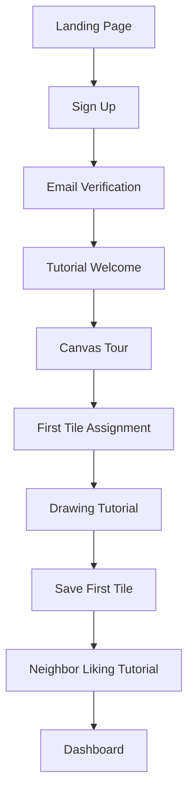
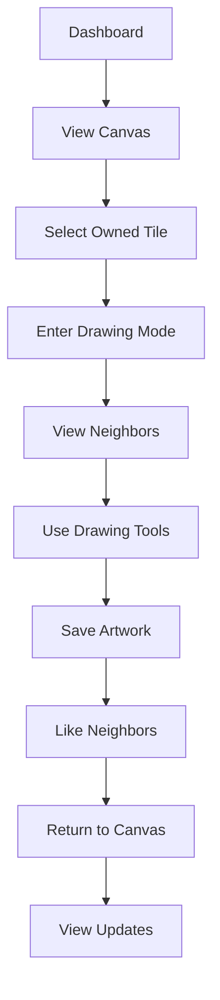
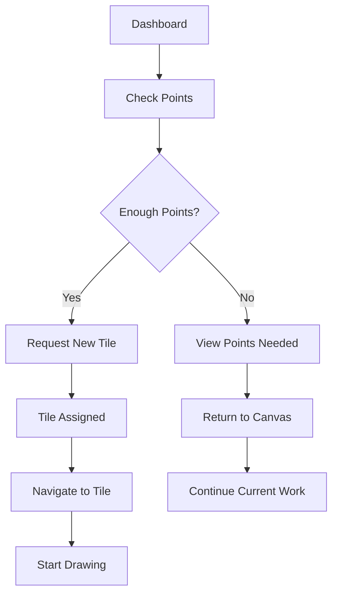

# UI/UX Design Document: Collaborative Pixel Canvas Game

## Overview

This document outlines the user interface and user experience design for the Collaborative Pixel Canvas Game, including user flows, wireframes, component specifications, and design patterns that will create an intuitive and engaging collaborative drawing experience.

## Design Principles

1. **Simplicity**: Clean, uncluttered interface that focuses on the creative process
2. **Accessibility**: Inclusive design that works for users of all abilities
3. **Responsive**: Seamless experience across different screen sizes
4. **Performance**: Fast, efficient rendering with minimal loading times
5. **Collaboration**: Clear visual indicators for community interaction
6. **Gamification**: Engaging progression system without overwhelming the core experience

## User Personas

### Primary Persona: Creative Collaborator
- **Age**: 18-35
- **Goals**: Express creativity, be part of a community project, see their work appreciated
- **Needs**: Easy-to-use drawing tools, clear feedback on their progress, inspiration from others
- **Frustrations**: Complex interfaces, slow loading, unclear instructions

### Secondary Persona: Casual Explorer
- **Age**: 25-45
- **Goals**: Relax, explore community creations, contribute casually
- **Needs**: Simple onboarding, clear navigation, easy way to like and appreciate art
- **Frustrations**: Overwhelming complexity, steep learning curve

## Information Architecture

### Site Map
```
├── Landing Page
├── Authentication
│   ├── Sign Up
│   ├── Sign In
│   └── Password Reset
├── Dashboard
│   ├── Canvas Overview
│   ├── User Stats
│   └── My Tiles
├── Canvas View
│   ├── Main Canvas
│   ├── Navigation Controls
│   └── Tile Details
├── Drawing Interface
│   ├── Pixel Editor
│   ├── Tool Palette
│   ├── Neighbor Preview
│   └── Save/Cancel Actions
├── User Profile
│   ├── Profile Settings
│   ├── Points History
│   └── Achievement Gallery
└── Help & Support
    ├── Tutorial
    ├── FAQ
    └── Community Guidelines
```

## User Flows

### 1. New User Onboarding Flow



### 2. Core Drawing Flow



### 3. Tile Request Flow



## Page Layouts and Components

### 1. Landing Page

**Purpose**: Welcome users and explain the concept

**Layout**:
```
┌─────────────────────────────────────────────────────┐
│                    Header                            │
│  Logo              Nav Menu          Sign In/Up     │
├─────────────────────────────────────────────────────┤
│                                                     │
│              Hero Section                           │
│         "Create Together, One Pixel at a Time"     │
│                                                     │
│        [Interactive Canvas Preview]                 │
│                                                     │
│              [Get Started Button]                   │
│                                                     │
├─────────────────────────────────────────────────────┤
│                                                     │
│              How It Works                           │
│    [Icon] Get a Tile  [Icon] Draw  [Icon] Like      │
│                                                     │
├─────────────────────────────────────────────────────┤
│                                                     │
│              Community Stats                        │
│    Active Artists | Tiles Painted | Total Likes    │
│                                                     │
├─────────────────────────────────────────────────────┤
│                   Footer                            │
└─────────────────────────────────────────────────────┘
```

**Key Components**:
- **Hero Animation**: Animated pixel art creation
- **Interactive Preview**: Mini-canvas showing real collaborative work
- **CTA Button**: Prominent, engaging call-to-action
- **Stats Counter**: Real-time community statistics

### 2. Authentication Pages

**Sign Up Layout**:
```
┌─────────────────────────────────────────────────────┐
│                    Header                            │
├─────────────────────────────────────────────────────┤
│                                                     │
│              Sign Up Form                           │
│                                                     │
│    Username    [________________]                   │
│    Email       [________________]                   │
│    Password    [________________]                   │
│                                                     │
│    □ I agree to Terms & Conditions                  │
│                                                     │
│             [Create Account]                        │
│                                                     │
│       Already have account? [Sign In]              │
│                                                     │
└─────────────────────────────────────────────────────┘
```

**Form Validation**:
- Real-time validation with clear error messages
- Password strength indicator
- Username availability check
- Accessible form labels and ARIA attributes

### 3. Dashboard

**Purpose**: Central hub for user activity and navigation

**Layout**:
```
┌─────────────────────────────────────────────────────┐
│                    Header                            │
│  Logo    Dashboard    Profile    [Username] [Logout] │
├─────────────────────────────────────────────────────┤
│                                                     │
│              Welcome Back, [Username]!              │
│                                                     │
│  ┌─────────────┐ ┌─────────────┐ ┌─────────────┐   │
│  │   Points    │ │   Tiles     │ │   Likes     │   │
│  │    150      │ │     3       │ │     25      │   │
│  └─────────────┘ └─────────────┘ └─────────────┘   │
│                                                     │
│              [Request New Tile]                     │
│                                                     │
├─────────────────────────────────────────────────────┤
│                                                     │
│              Your Tiles                             │
│                                                     │
│  ┌─────────────┐ ┌─────────────┐ ┌─────────────┐   │
│  │  Tile (0,5) │ │ Tile (12,8) │ │ Tile (25,3) │   │
│  │   ♥ 8 likes │ │   ♥ 3 likes │ │   ♥ 2 likes │   │
│  │  [Edit]     │ │  [Edit]     │ │  [Edit]     │   │
│  └─────────────┘ └─────────────┘ └─────────────┘   │
│                                                     │
├─────────────────────────────────────────────────────┤
│                                                     │
│              [View Main Canvas]                     │
│                                                     │
└─────────────────────────────────────────────────────┘
```

**Key Features**:
- **Stats Cards**: Visual representation of user progress
- **Tile Gallery**: Thumbnail grid of user's tiles with metrics
- **Quick Actions**: Easy access to primary user actions
- **Progress Indicators**: Visual feedback on points and achievements

### 4. Canvas View

**Purpose**: Main collaborative canvas viewing experience

**Layout**:
```
┌─────────────────────────────────────────────────────┐
│                    Header                            │
│  Logo    Canvas    [Zoom] [Grid] [Points: 150]      │
├─────────────────────────────────────────────────────┤
│                                                     │
│                                                     │
│              [Canvas Display Area]                  │
│                                                     │
│     ┌─────┬─────┬─────┬─────┬─────┐                │
│     │  T  │  T  │  T  │  T  │  T  │                │
│     ├─────┼─────┼─────┼─────┼─────┤                │
│     │  T  │ YOU │  T  │  T  │  T  │                │
│     ├─────┼─────┼─────┼─────┼─────┤                │
│     │  T  │  T  │  T  │  T  │  T  │                │
│     └─────┴─────┴─────┴─────┴─────┘                │
│                                                     │
│                                                     │
├─────────────────────────────────────────────────────┤
│  [Dashboard] [Zoom Out] [Zoom In] [Center on Mine]  │
└─────────────────────────────────────────────────────┘
```

**Interactive Elements**:
- **Tile Highlighting**: User's tiles highlighted with colored borders
- **Zoom Controls**: Smooth zoom in/out with mouse wheel
- **Grid Toggle**: Optional grid lines for better visibility
- **Navigation**: Pan and zoom with mouse/touch controls
- **Tile Info**: Hover tooltips showing tile owner and stats

### 5. Drawing Interface

**Purpose**: Pixel art creation with neighbor context

**Layout**:
```
┌─────────────────────────────────────────────────────┐
│                    Header                            │
│  Logo    Drawing    [Save] [Cancel] [Points: 150]   │
├─────────────────────────────────────────────────────┤
│                                                     │
│  ┌─────────────┐              ┌─────────────────┐   │
│  │   Tools     │              │   Neighbors     │   │
│  │             │              │                 │   │
│  │  ● Brush    │              │  ┌───┬───┬───┐  │   │
│  │  ○ Eraser   │              │  │ N │ N │ N │  │   │
│  │             │              │  ├───┼───┼───┤  │   │
│  │  Size: ●●○  │              │  │ N │YOU│ N │  │   │
│  │             │              │  ├───┼───┼───┤  │   │
│  │  [Color     │              │  │ N │ N │ N │  │   │
│  │   Palette]  │              │  └───┴───┴───┘  │   │
│  │             │              │                 │   │
│  └─────────────┘              └─────────────────┘   │
│                                                     │
│                                                     │
│              [32x32 Pixel Canvas]                   │
│                                                     │
│        ┌─────────────────────────────────┐         │
│        │                                 │         │
│        │                                 │         │
│        │           YOUR TILE             │         │
│        │                                 │         │
│        │                                 │         │
│        └─────────────────────────────────┘         │
│                                                     │
├─────────────────────────────────────────────────────┤
│          [Save & Like Neighbors] [Cancel]           │
└─────────────────────────────────────────────────────┘
```

**Drawing Tools**:
- **Brush Tool**: Variable size (1-3 pixels)
- **Eraser Tool**: Remove pixels
- **Color Palette**: 16-color palette with custom colors
- **Pixel Grid**: Optional grid overlay for precision
- **Undo/Redo**: History management for drawing actions

### 6. Neighbor Liking Interface

**Purpose**: Encourage community appreciation after tile completion

**Layout**:
```
┌─────────────────────────────────────────────────────┐
│                    Header                            │
│  Logo    Canvas    [Points: 150]                    │
├─────────────────────────────────────────────────────┤
│                                                     │
│              Great work! Now like your neighbors    │
│                                                     │
│                                                     │
│              ┌─────────────────────────────┐       │
│              │                             │       │
│              │  ┌─────┬─────┬─────┐       │       │
│              │  │  ?  │  ♥  │  ?  │       │       │
│              │  ├─────┼─────┼─────┤       │       │
│              │  │  ♥  │YOURS│  ♥  │       │       │
│              │  ├─────┼─────┼─────┤       │       │
│              │  │  ♥  │  ?  │  ♥  │       │       │
│              │  └─────┴─────┴─────┘       │       │
│              │                             │       │
│              └─────────────────────────────┘       │
│                                                     │
│       Click ♥ to like inspiring neighboring tiles  │
│                                                     │
├─────────────────────────────────────────────────────┤
│              [Done] [Back to Canvas]                │
└─────────────────────────────────────────────────────┘
```

**Interaction Flow**:
- Only show painted neighboring tiles
- Clear like/unlike visual feedback
- Prevent liking own tiles
- Show appreciation messages when likes are given

## Design System

### Color Palette

**Primary Colors**:
- **Canvas Blue**: #2563EB (Primary actions, links)
- **Pixel Purple**: #7C3AED (Secondary actions, highlights)
- **Success Green**: #059669 (Confirmations, likes)
- **Warning Orange**: #D97706 (Warnings, attention)
- **Error Red**: #DC2626 (Errors, validation)

**Neutral Colors**:
- **Background**: #F8FAFC (Page backgrounds)
- **Surface**: #FFFFFF (Cards, modals)
- **Border**: #E2E8F0 (Dividers, borders)
- **Text Primary**: #1E293B (Headers, important text)
- **Text Secondary**: #64748B (Body text, descriptions)
- **Text Muted**: #94A3B8 (Captions, metadata)

**Pixel Art Palette** (Default 16 colors):
```
#000000 #FFFFFF #FF0000 #00FF00 #0000FF #FFFF00 #FF00FF #00FFFF
#800000 #008000 #000080 #808000 #800080 #008080 #C0C0C0 #808080
```

### Typography

**Font Stack**: 
- Primary: `'Inter', -apple-system, BlinkMacSystemFont, 'Segoe UI', sans-serif`
- Monospace: `'Fira Code', 'Monaco', 'Courier New', monospace`

**Type Scale**:
- **Display**: 48px/56px, Bold (Hero headings)
- **H1**: 36px/44px, Bold (Page titles)
- **H2**: 30px/36px, Semibold (Section headings)
- **H3**: 24px/32px, Medium (Subsections)
- **Body Large**: 18px/28px, Regular (Important body text)
- **Body**: 16px/24px, Regular (Default body text)
- **Body Small**: 14px/20px, Regular (Captions, metadata)
- **Caption**: 12px/16px, Medium (Labels, tiny text)

### Component Specifications

#### Buttons

**Primary Button**:
```css
.btn-primary {
  background: #2563EB;
  color: white;
  padding: 12px 24px;
  border-radius: 8px;
  font-weight: 600;
  font-size: 16px;
  border: none;
  cursor: pointer;
  transition: all 0.2s ease;
}

.btn-primary:hover {
  background: #1D4ED8;
  transform: translateY(-1px);
}
```

**Secondary Button**:
```css
.btn-secondary {
  background: transparent;
  color: #2563EB;
  border: 2px solid #2563EB;
  padding: 10px 22px;
  border-radius: 8px;
  font-weight: 600;
  font-size: 16px;
  cursor: pointer;
  transition: all 0.2s ease;
}

.btn-secondary:hover {
  background: #2563EB;
  color: white;
}
```

#### Cards

**Tile Card**:
```css
.tile-card {
  background: white;
  border-radius: 12px;
  padding: 16px;
  box-shadow: 0 1px 3px rgba(0, 0, 0, 0.1);
  border: 1px solid #E2E8F0;
  transition: all 0.2s ease;
}

.tile-card:hover {
  box-shadow: 0 4px 12px rgba(0, 0, 0, 0.15);
  transform: translateY(-2px);
}
```

#### Form Elements

**Input Field**:
```css
.form-input {
  width: 100%;
  padding: 12px 16px;
  border: 2px solid #E2E8F0;
  border-radius: 8px;
  font-size: 16px;
  transition: border-color 0.2s ease;
}

.form-input:focus {
  border-color: #2563EB;
  outline: none;
  box-shadow: 0 0 0 3px rgba(37, 99, 235, 0.1);
}
```

### Responsive Design

#### Breakpoints
- **Mobile**: 320px - 768px
- **Tablet**: 768px - 1024px
- **Desktop**: 1024px - 1440px
- **Wide Desktop**: 1440px+

#### Mobile Adaptations

**Canvas View (Mobile)**:
```
┌─────────────────────────────────┐
│         Header                  │
│  Logo    [Menu]    [Points: 150]│
├─────────────────────────────────┤
│                                 │
│                                 │
│         [Canvas Area]           │
│                                 │
│                                 │
│                                 │
│                                 │
│                                 │
│                                 │
├─────────────────────────────────┤
│ [Dashboard] [Zoom] [My Tiles]   │
└─────────────────────────────────┘
```

**Drawing Interface (Mobile)**:
```
┌─────────────────────────────────┐
│         Header                  │
│  [Back]  Drawing    [Save]      │
├─────────────────────────────────┤
│                                 │
│         [32x32 Canvas]          │
│                                 │
├─────────────────────────────────┤
│         [Color Palette]         │
├─────────────────────────────────┤
│ [Brush] [Eraser] [Size: ●●○]   │
└─────────────────────────────────┘
```

## Accessibility Standards

### WCAG 2.1 AA Compliance

**Color Contrast**:
- Text on background: 4.5:1 minimum
- Large text: 3:1 minimum
- Interactive elements: 3:1 minimum

**Keyboard Navigation**:
- Tab order follows logical flow
- All interactive elements focusable
- Clear focus indicators
- Escape key closes modals

**Screen Reader Support**:
- Semantic HTML structure
- ARIA labels and descriptions
- Alt text for images
- Status announcements for dynamic content

**Motor Accessibility**:
- Minimum 44px touch targets
- Click/tap tolerance for pixel art
- Hover states don't hide content
- No time-based actions required

### Accessibility Features

**Drawing Interface**:
- High contrast mode toggle
- Keyboard pixel placement (arrow keys)
- Screen reader announcements for tool changes
- Voice control compatibility

**Canvas Navigation**:
- Keyboard shortcuts for zoom/pan
- Screen reader canvas descriptions
- Alternative text-based tile coordinate system

## Animation and Micro-interactions

### Loading States

**Canvas Loading**:
```css
.tile-loading {
  background: linear-gradient(90deg, #f0f0f0 25%, #e0e0e0 50%, #f0f0f0 75%);
  background-size: 200% 100%;
  animation: loading 1.5s infinite;
}

@keyframes loading {
  0% { background-position: 200% 0; }
  100% { background-position: -200% 0; }
}
```

**Button Interactions**:
- Hover: Slight scale and color change
- Click: Brief scale down with haptic feedback
- Success: Checkmark animation
- Error: Shake animation

### Feedback Animations

**Like Animation**:
```css
@keyframes like-burst {
  0% { transform: scale(1); }
  50% { transform: scale(1.2); }
  100% { transform: scale(1); }
}

.like-animation {
  animation: like-burst 0.3s ease-out;
}
```

**Tile Save Success**:
- Subtle pulse animation
- Check mark overlay
- Smooth transition to canvas view

## Performance Considerations

### Canvas Optimization

**Viewport Rendering**:
- Only render visible tiles
- Virtual scrolling for large canvases
- Lazy loading of tile images
- Efficient tile caching

**Image Optimization**:
- WebP format for tile images
- Appropriate image sizes for different zoom levels
- Progressive loading for large canvases
- Sprite sheets for UI elements

### User Experience Optimizations

**Perceived Performance**:
- Skeleton screens during loading
- Optimistic UI updates
- Smooth transitions between states
- Preloading of likely next actions

**Offline Capabilities**:
- Cache recently viewed canvas regions
- Offline drawing with sync when online
- Service worker for app shell caching
- Clear offline/online status indicators

## Testing Strategy

### Usability Testing

**Key Scenarios**:
1. New user onboarding completion
2. First tile drawing and save
3. Neighbor tile discovery and liking
4. Canvas navigation and exploration
5. Multi-tile workflow management

**Success Metrics**:
- Time to first tile completion: < 3 minutes
- User engagement rate: > 80% complete onboarding
- Return rate: > 60% return within 24 hours
- Feature adoption: > 70% like at least one tile

### A/B Testing Opportunities

**Onboarding Flow**:
- Tutorial length and complexity
- Tile assignment strategy
- Initial canvas position

**Drawing Interface**:
- Tool layout and organization
- Color palette size and arrangement
- Neighbor visibility options

**Gamification Elements**:
- Points display prominence
- Achievement notification timing
- Progress visualization methods

---

**Document Version**: 1.0  
**Created**: January 2025  
**Status**: Ready for Implementation Planning 